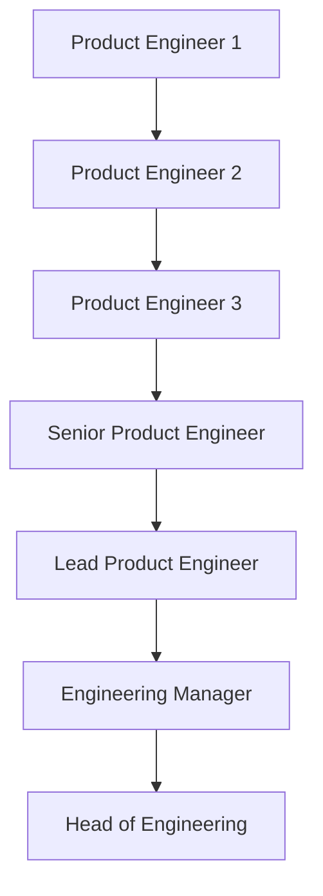

# Welcome, Entry Level!

Welcome! This repo hosts a basic set of guidelines for Indonesian students and fresh graduates to land their first tech job at [Zero One Group](https://www.linkedin.com/company/zeroonegroup)!

This document is a constant work in progress. If you spot any mistakes, have any feedback or even disagree some of the points made in this document, please feel free to open an issue and tag @rubiagatra and/or @anthony-khong!

## Contents

- [Background](#background)
  - [What is Zero One Group?](#what-is-zero-one-group)
  - [A Remote-First Engineering Team](#a-remote-first-engineering-team)
  - [Investing in Our Engineers](#investing-in-our-engineers)
  - [Our Support for Open-Source and Local Tech Ecosystems](#our-support-for-open-source-and-local-tech-ecosystems)
- [Zero One Group Career Ladder](#zero-one-group-career-ladder)
- [How to Get Quality Courses for Free or at Little Cost](#how-to-get-quality-courses-for-free-or-at-little-cost)
  - [Github Student Pack](#github-student-pack)
  - [Free Courses](#free-courses)
  - [Affordable Courses](#affordable-courses)
- [Prerequisites](#prerequisites)
- [Getting Started](#getting-started)
- [Paths and Specialisations](#paths-and-specialisations)
  - [Backend](#backend)
  - [Web](#web)
  - [Mobile](#mobile)
  - [DevOps](#mobile)
- [How to Apply](#how-to-apply)
- [Interviewing at Zero One](#interviewing-at-zero-one)
    - [Interview Format](#interview-format)
    - [Tips and Advice](#tips-and-advice)
- [What Can I Do to Improve My Chances of Getting Accepted?](#what-can-i-do-to-improve-my-chances-of-getting-accepted)

**[⬆ back to top](#contents)**

## Background

### What is Zero One Group?

We provide an ecosystem of cutting-edge technological solutions to challenging business problems. We work with Indonesia's household enterprises such as [HokBen](https://www.hokben.co.id/) and well-established international institutions such as [Bloomberg Philantropies](https://www.bloomberg.org/). Apart from being deeply involved in the JS ecosystem with [Node](https://nodejs.org/en/) and [React](https://reactjs.org/), we also routinely use [Flutter](https://flutter.dev) and [Terraform](https://terraform.io) as part of our tech stack.

### A Remote-First Engineering Team

We are a 'remote-first' engineering team. It means that our default means of communications is asynchronous, which does not require the engineering team to be in the same place at the same time. An important implication of this is that engineers that are not based in Jakarta, where our main office is located, still get a first-class experience with Zero One Group. They never feel left out from important team discussions, and they don't miss out on unintentionally decisive water cooler conversations.

Currently, our remote engineering team consists of developers based in Greater Jakarta, Purbalingga, Kulon Progo, Surabaya, Malang and Makassar.

### Investing In Our Engineers

One of our co-founders, Didit, used to always say that he would like "to build a company **for engineers by engineers**". Indeed, we often claim that we are an engineering-first company, but what does it mean? At a high level, we want to optimise for engineers' comfort, productivity and growth. We would like to create a working environment where engineers can do their best work, make a real difference through software and be proud of their accomplishments. And all the while, they must also have the opportunity to explore new technologies and develop technically. We constantly invest in learning curriculums, career ladders, handbooks, mentoring schemes and other support systems so that we can be better at providing that working environment.

An unusual fact about Zero One Technology is that every founding member is or has been an engineer! We fully understand what it feels like to walk in the shoes of an engineer. We view the profession as a form craftsmanship - something that takes a lifetime to master. Thus, we respect the engineer as both a professional and an artist.

### Our Support for Open Source and Local Tech Ecosystems

Every engineer in Zero One Group is expected to contribute to open-source software at some point in their tenure. Here are some of the projects that we have initiated or actively contributed to:

- [Geni: A Clojure dataframe library that runs on Spark](https://github.com/zero-one-group/geni)
- [fxl: ƛ fxl.js is a data-oriented JavaScript spreadsheet library](https://github.com/zero-one-group/fxl.js)
- [fastify: Fast and low overhead web framework, for Node.js](https://github.com/fastify/fastify)
- [Metabase: The simplest, fastest way to get business intelligence and analytics to everyone in your company 😋](https://github.com/metabase/metabase)
- [Prisma: Next-generation ORM for Node.js & TypeScript | PostgreSQL, MySQL, MariaDB, SQL Server, SQLite & MongoDB (Preview)](https://github.com/prisma/prisma)
- [Turborepo: The High-performance Build System for JavaScript & TypeScript Codebases](https://github.com/vercel/turborepo)
- [Node Addon Api: Module for using Node-API from C++](https://github.com/nodejs/node-addon-api)
- [Undici: An HTTP/1.1 client, written from scratch for Node.js](https://github.com/nodejs/undici)

We also encourage our engineers to share what they've learned publicly and give back to the community:

- [Understanding Node.JS Performance using OpenTelemetry | Kubernetes Community Days ID 2021](https://www.youtube.com/watch?v=0Enmo1kFNSE)
- [fxl: a composable data-oriented spreadsheet library for Clojure | Scicloj 2021](https://www.youtube.com/watch?v=d6qOzPQ9NUk)
- [Geni: a Clojure dataframe library on Spark | Scicloj 2021](https://www.youtube.com/watch?v=3R2FJQdtLf8)
- [Prinsip Dasar dalam Membuat Web Visualisasi Data Interaktif | WWW ID 2020](https://www.youtube.com/watch?v=OPX2l1P96nE)
- [Functional 101 with Python | PyCon Indonesia 2019](https://www.youtube.com/watch?v=uXhZML1Z0Vg)
- [Functional Programming in Python - Lessons from Haskell and Clojure | PyCon Thailand 2019](https://www.youtube.com/watch?v=UgnCnEDrMM8)

At times, we also write about the challenges and thinking that go into particular tech problems that we encounter:

- [Ionic, React Native, and Flutter in One Nx Monorepo](medium.com/@zeroonegroup/ionic-react-native-and-flutter-in-one-nx-monorepo-ff58196a0125)
- [Customer Segmentation: Taking a Page out of the Computer Vision Book](https://medium.com/zero-one-group/customer-segmentation-taking-a-page-out-of-the-computer-vision-book-af02155ccf53)
- [Having Fun with Clojurescript on Google Cloud Function](https://medium.com/zero-one-group/having-fun-with-clojurescript-on-google-cloud-function-8434d5f94d25)

A significant portion of our engineers actively participate in local and international tech communities. If you have the chance to join one of the events by the communities below, you may bump into someone from Zero One Group. Please come and say hello - we would love to hear from you!

- [Surabaya.js](https://surabayajs.org)
- [Surabaya.py](https://surabayapy.github.io/)
- [GDG Jogjakarta](https://gdg.community.dev/gdg-jogjakarta/)
- [GDG Surabaya](https://gdg.community.dev/gdg-surabaya/)
- [GDG Cloud Surabaya](https://gdg.community.dev/gdg-cloud-surabaya/)
- [Lamongan Dev](https://www.instagram.com/lamongandev/?hl=en)
- [Ngalam Backend](https://www.instagram.com/ngalambackend/?hl=en)
- [Data Science Indonesia](https://datascience.or.id/)
- [Scicloj](https://scicloj.github.io/)

**[⬆ back to top](#contents)**

## Zero One Group Career Ladder

Based on Zero One Group Career Ladder, what you aiming for as an entry level are PE 1 or PE 2. PE 1 and PE 2
experiences ranging from 0 - 2 years experiences of work.

**[⬆ back to top](#contents)**

## How to Get Quality Courses for Free or at Little Cost

As a student, you will get benefit from multiple learning platforms as long as you have your university email `name@university.ac.id`. We provide a list of free or inexpensive learning materials below.

### Github Student Pack

[GitHub Student Pack](https://education.github.com/pack) is a really good bet for a free learning platform and software tools! At the time of writing, these are the learning materials you can get if you apply GitHub Student Pack:

- [FrontendMasters - Advance your skills with in-depth JavaScript, Node.js & front-end engineering courses](https://frontendmasters.com/)
- [OneMonth - Learn HTML, CSS, JavaScript and Python in just 30 days!](https://onemonth.com/)
- [GoRails - Tutorials for web developers learning Ruby, Rails, Javascript, Turbolinks, Stimulus.js, Vue.js, and more](https://gorails.com/)
- [Thinkful - Learn Fundamentals of Web Development to launch your career as a developer](https://www.thinkful.com/)
- [Educative - Level up on trending coding skills at your own pace with interactive, text-based courses](https://educative.io)
- [DataCamp - DataCamp helps companies and individuals make better use of data. Our users build data fluency while learning from the world’s top data scientists](https://www.datacamp.com)

### Free Courses

- [FreeCodeCamp - Learn to code — for free. Build projects. Earn certifications.](https://www.freecodecamp.org/)
- [Coursera (Audit Course) - Build Skills with Online Courses from Top Institutions](https://www.coursera.org/)
- [edX - Free Online Courses by Harvard, MIT, & more](https://www.edx.org/)
- [Codecademy: Learn to Code - for Free](https://www.codecademy.com/)

### Affordable Courses

- [Udemy - Online Courses - Learn Anything, On Your Schedule](https://udemy.com)
- [Codepolitan - Website Belajar Coding Bahasa Indonesia](https://codepolitan.com/)
- [Dicoding - Bangun Karirmu Sebagai Developer Profesiona](https://www.dicoding.com/)

**[⬆ back to top](#contents)**

## Prerequisites

An understanding of the concept of programming in the web is a prerequisite for an engineering role at Zero One Technology.
If you are starting from zero, you can follow this bootcamp:

- [FrontendMasters Bootcamp - Get access to everything you need to get started developing websites.
  Learn HTML, CSS and JavaScript through project-based learning](https://frontendmasters.com/bootcamp/)

or

- [FrontendMasters - Beginner Path](https://frontendmasters.com/learn/beginner/)

**[⬆ back to top](#contents)**

## Getting Started

If you finish the following learning materials, you will be in a great position to apply for a Product Engineer 1 position:

- [FrontendMasters - JS Fundamentals Functionals](https://frontendmasters.com/courses/js-fundamentals-functional-v2/)
- [FrontendMasters - CSS Grids and Flexbox](https://frontendmasters.com/courses/css-grid-flexbox-v2/)
- [FrontendMasters - Full Stack for Front End](https://frontendmasters.com/courses/fullstack-v2/)
- [FrontendMasters - Complete Intro for Linux and Command Line](https://frontendmasters.com/courses/linux-command-line/)
- [FrontendMasters - Introduction to Node JS](https://frontendmasters.com/courses/node-js-v2/)
- [FrontendMasters - Complete Intro to Containers](https://frontendmasters.com/courses/complete-intro-containers/)
- [FrontendMasters - Api Design in Node JS](https://frontendmasters.com/courses/api-design-nodejs-v3/)
- [FrontendMasters - Learn Git in Depth](https://frontendmasters.com/courses/git-in-depth/)
- [FrontendMasters - Intro all Databases](https://frontendmasters.com/courses/databases/)
- [FrontendMasters - Introduction to DevTools](https://frontendmasters.com/courses/dev-tools/)
- [Udemy - Complete NodeJS Developer](https://www.udemy.com/course/complete-nodejs-developer-zero-to-mastery/)
- [FrontendMasters - TypeScript Fundamentals](https://frontendmasters.com/courses/typescript-v3/)
- [FrontendMasters - Complete Intro React](https://frontendmasters.com/courses/complete-react-v6/)
- [FrontendMasters - Intermediate React](https://frontendmasters.com/courses/intermediate-react-v2/)

**[⬆ back to top](#contents)**

## Paths and Specialisations

### Backend

- [FrontendMasters - Functional JavaScript First Steps](https://frontendmasters.com/courses/functional-first-steps/)
- [Udemy - SQL and PostgreSQL](https://www.udemy.com/course/sql-and-postgresql/)
- [FrontendMasters - Intermediate TypeScript](https://frontendmasters.com/courses/intermediate-typescript/)
- [Udemy - Docker for Node.js Projects From a Docker Captain](https://www.udemy.com/course/docker-mastery-for-nodejs/)
- [Udemy - GitLab CI: Pipelines, CI/CD and DevOps for Beginners](https://www.udemy.com/course/gitlab-ci-pipelines-ci-cd-and-devops-for-beginners/)
- [Udemy - Introduction to Database Engineering](https://www.udemy.com/course/database-engines-crash-course/)
- [Udemy - gRPC Node.js MasterClass: Build Modern API & Microservices](https://www.udemy.com/course/grpc-nodejs/)
- [FrontendMasters - Complete Intro to Real-Time](https://frontendmasters.com/courses/realtime/)
- [Udemy - Pragmatic System Design](https://www.udemy.com/course/pragmatic-system-design/)
- [UML and Object-Oriented Design Foundations](https://www.udemy.com/course/uml-and-object-oriented-design-foundations/)
- [Master Fullstack - React, Fastify Node.js, Postgresql & TDD](https://www.udemy.com/course/fullstack-project-react-fastify-nodejs-postgresql-tdd/)

### Frontend Path

- [FrontendMasters - Functional JavaScript First Steps](https://frontendmasters.com/courses/functional-first-steps/)
- [FrontendMasters - Build a Fullstack App from Scratch (feat Next.js)](https://frontendmasters.com/courses/fullstack-app-next/)
- [FrontendMasters - React and TypeScript](https://frontendmasters.com/courses/react-typescript/)
- [FrontendMasters - Web Performance](https://frontendmasters.com/courses/web-perf/)
- [FrontendMasters - Intermediate TypeScript](https://frontendmasters.com/courses/intermediate-typescript/)
- [Udemy - GitLab CI: Pipelines, CI/CD and DevOps for Beginners](https://www.udemy.com/course/gitlab-ci-pipelines-ci-cd-and-devops-for-beginners/)
- [Udemy - Testing React with Jest and Testing Library](https://www.udemy.com/course/react-testing-library/)
- [Udemy - Cypress: Web Automation Testing from Zero to Hero](https://www.udemy.com/course/cypress-web-automation-testing-from-zero-to-hero/)
- [FrontendMasters - AWS For Front-End Engineers, v2](https://frontendmasters.com/courses/aws-v2/)
- [Udemy - Master Fullstack - React, Fastify Node.js, Postgresql & TDD](https://www.udemy.com/course/fullstack-project-react-fastify-nodejs-postgresql-tdd/)

### Mobile Path

- [Udemy - Flutter & Dart - The Complete Guide 2022 Edition](https://www.udemy.com/course/learn-flutter-dart-to-build-ios-android-apps/)
- [Youtube - Testing Fundamentals of Flutter Course](https://www.youtube.com/playlist?list=PLprI2satkVdFwpxo_bjFkCxXz5RluG8FY)
- [Udemy - The Complete Dart Language Guide for Beginners and Beyond](https://www.udemy.com/course/complete-dart-guide/)
- [Udemy - Flutter & Firebase: Build a Complete App for iOS & Android](https://www.udemy.com/course/flutter-firebase-build-a-complete-app-for-ios-android/)
- [Udemy - Flutter REST API Crash Course: Build a Coronavirus App](https://www.udemy.com/course/flutter-rest-api-crash-course-build-a-coronavirus-app/)

### DevOps Path

- [Udemy - GitLab CI: Pipelines, CI/CD and DevOps for Beginners](https://www.udemy.com/course/gitlab-ci-pipelines-ci-cd-and-devops-for-beginners/)
- [Udemy - Ultimate AWS Certified Cloud Practitioner - 2022](https://www.udemy.com/course/aws-certified-cloud-practitioner-new/)
- [Udemy - GCP for Beginners - Become a Google Cloud Digital Leader](https://www.udemy.com/course/google-cloud-digital-leader-certification/)
- [Udemy - Introduction to NGINX](https://www.udemy.com/course/nginx-crash-course/)
- [Udemy - Amazon ECS & Fargate Master Class - Docker on AWS](https://www.udemy.com/course/aws-ecs-fargate/)
- [Udemy - Learn DevOps: Infrastructure Automation With Terraform](https://www.udemy.com/course/learn-devops-infrastructure-automation-with-terraform)
- [Udemy - Terraform Beginner to Advanced - Using Google Cloud Platform](https://www.udemy.com/course/terraform-beginner-to-advanced-using-google-cloud-platform/)
- [Udemy - Ansible for the Absolute Beginner - Hands-On - DevOps](https://www.udemy.com/course/learn-ansible-advanced/)

**[⬆ back to top](#contents)**

## How to Apply

Please send your CV and/or portofolio to info@zero-one-group.com and cc doni@zero-one-group.com. Typically, the interview process consists of a technical interview, a general interview and a skill test.

**[⬆ back to top](#contents)**

## Interviewing at Zero One

### Interview Format

In a typical case, we require a skill test and two interview rounds - general and technical. The two interviews do not have a fixed order, but the skill test is typically sandwiched between the two interviews.

You should not need to prepare for the general interview round, as it should resemble a friendly chat about your life, hobbies, motivation, career goals, technical interests and past experiences. It is a way for us to get to know you better, and assess whether you would fit in well to the team we are hiring for. You should, however, prepare for the technical interview, as you will be tested not only on the depth, but also on the breadth of your knowledge. For that reason, be prepared to answer questions outside the area of your expertise!

Our skill test consists of a simple task in an area of expertise that you can choose, namely backend, web frontend, mobile or devops. Typically, the deadline of the skill test is set 72 hours after the test is sent to you. You may choose the day and time to start the test to fit your schedule!

### Tips and Advice

- Accept the calendar invitation, and turn up on time. We take punctuality and commitment very seriously.
- We also take deadlines very seriously. If you think you're not going to meet the skill test deadline, reach out to us early, and explain your situation. There is not much we can do if you tell us a few hours before the deadline!
- Speak freely and openly about your opinions and experience. We love genuine (though perhaps unusual) candidates!
- Be relaxed! Treat the interview as a casual conversation. There is no need to use formal languages such as 'Pak', 'Bu' or 'sebelumnya terima kasih, perkenalkan nama saya ...'. We are not that kind of company 😂
- If you don't know the answer to a question, it's better to say so, instead of guessing the answer. And do look it up after the interview - we may ask you the same question again!
- Read and learn widely. You are **not** expected to know everything about software development, but you should know a little bit about backend, web frontend, mobile and devops.
- We love personal projects, open-source contributions and online courses. If you are not asked about it in your interview, do proactively tell us about it!

**[⬆ back to top](#contents)**

## What Can I Do to Improve My Chances of Getting Accepted

- Complete related online courses.
- Contribute to open-source software.
- Work on your side projects or software portofolio.
- Participate in your local tech communities.
- Dive deep into TypeScript or static typing in general.
- Practice and get comfortable with automated testing. 
- Design and experiment with your own CI/CD pipelines.
- Impressing us with your (Neo)Vim setup! haha we're just joking 😆 (or are we? 🤔)

**[⬆ back to top](#contents)**
