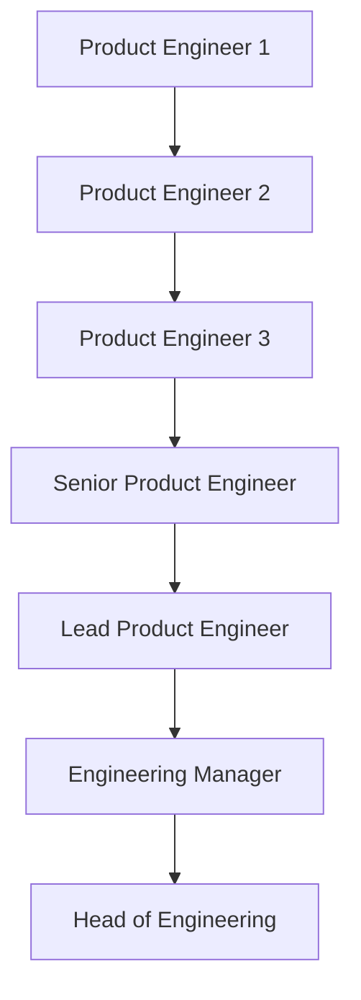

# Welcome Entry Level

Guideline for Indonesian student to land their first tech job at [Zero One Group](https://www.linkedin.com/company/zeroonegroup).

## Contents

- [Welcome Entry Level](#welcome-entry-level)
  - [Background](#background)
    - [What is Zero One Group](#what-is-zero-one-group)
    - [Investing in The Future](#investing-in-the-future)
  - [Zero One Group Career Ladder](#zero-one-group-career-ladder)
  - [How to Get Quality Courses for Free or Cheap](#how-to-get-quality-courses-for-free-or-cheap)
    - [Github Student Pack](#github-student-pack)
    - [Free Courses](#free-courses)
    - [Relatively Cheap Courses](#relatively-cheap-courses)
  - [General](#General)
  - [Backend Path](#backend-path)
  - [Web Path](#web-path)
  - [Mobile Path](#mobile-path)
  - [DevOps Path](#mobile-path)
  - [How to Apply](#how-to-apply)
  - [What Can I Do to Improve My Chances of Getting Accepted](#what-can-i-do-to-improve-my-chances-of-getting-accepted)

**[⬆ back to top](#contents)**

## Background

### What is Zero One Group

We are an ecosystem of cutting-edge technology solutions. We have multiple clients from International e.g [Bloomberg Philantropies](https://www.bloomberg.org/) to National Enterprise Company e.g [HokBen](https://www.hokben.co.id/). Currently, Our Focus technology are [Node.js](https://nodejs.org/en/), [React](https://reactjs.org/), [Flutter](https://flutter.dev), and [Terraform](https://terraform.io).

We also already giving back to the community ranging from

#### Creating or Contributing Open Source Projects

- [Geni: A Clojure dataframe library that runs on Spark](https://github.com/zero-one-group/geni)
- [fxl: ƛ fxl.js is a data-oriented JavaScript spreadsheet library](https://github.com/zero-one-group/fxl.js)
- [fastify: Fast and low overhead web framework, for Node.js](https://github.com/fastify/fastify)
- [Metabase: The simplest, fastest way to get business intelligence and analytics to everyone in your company 😋](https://github.com/metabase/metabase)
- [Prisma: Next-generation ORM for Node.js & TypeScript | PostgreSQL, MySQL, MariaDB, SQL Server, SQLite & MongoDB (Preview)](https://github.com/prisma/prisma)
- [Turborepo: The High-performance Build System for JavaScript & TypeScript Codebases](https://github.com/vercel/turborepo)
- [Node Addon Api: Module for using Node-API from C++](https://github.com/nodejs/node-addon-api)
- [Undici: An HTTP/1.1 client, written from scratch for Node.js](https://github.com/nodejs/undici)

#### Talks

- [Understanding Node.JS Performance using OpenTelemetry | Kubernetes Community Days ID 2021](https://www.youtube.com/watch?v=0Enmo1kFNSE)
- [Prinsip Dasar dalam Membuat Web Visualisasi Data Interaktif | WWW ID 2020 | Bahasa Indonesia](https://www.youtube.com/watch?v=OPX2l1P96nE)

#### Blogs

- [Ionic, React Native, and Flutter in One Nx Monorepo](medium.com/@zeroonegroup/ionic-react-native-and-flutter-in-one-nx-monorepo-ff58196a0125)
- [Customer Segmentation: Taking a Page out of the Computer Vision Book](https://medium.com/zero-one-group/customer-segmentation-taking-a-page-out-of-the-computer-vision-book-af02155ccf53)
- [Having Fun with Clojurescript on Google Cloud Function](https://medium.com/zero-one-group/having-fun-with-clojurescript-on-google-cloud-function-8434d5f94d25)

#### Contributing to Local Community Partners

- [Surabaya.js](https://surabayajs.org)
- [Surabaya.py](https://surabayapy.github.io/)
- [GDG Jogjakarta](https://gdg.community.dev/gdg-jogjakarta/)
- [GDG Surabaya](https://gdg.community.dev/gdg-surabaya/)
- [GDG Cloud Surabaya](https://gdg.community.dev/gdg-cloud-surabaya/)
- [Lamongan Dev](https://www.instagram.com/lamongandev/?hl=en)
- [Ngalam Backend](https://www.instagram.com/ngalambackend/?hl=en)
- [Data Science Indonesia](https://datascience.or.id/)

In Zero One Group, We don't have HQ for our engineers. We are first-remote company that emphasis on Async Communication. Our team spread across Indonesia, Jabodetabek, Jogjakarta, East Java South Sulawesi and we are still expanding.

### Investing in our engineers

We are an engineering-first company, what does it mean? It means that every member of the Zero One Technology core team is an engineer or has worked as an engineer in the past - yes, even the co-founders and managers! One of our co-founders, Didit, used to always say that he would like “to build a company for engineers by engineers”.

In practice, this means that we want to make a working environment where engineers are comfortable, and productive, have the opportunity to significantly grow their technical skills and be proud of their accomplishments with the company. Curriculum, Carrer Ladder, Handbooks, Mentoring, and all the support system we created for engineers to grow. It goes without saying that engineers are first-class citizens in Zero One Group!

**[⬆ back to top](#contents)**

## Zero One Group Career Ladder

Based on Zero One Group Career Ladder, what you aiming for as an entry level are PE 1 or PE 2. PE 1 and PE 2
experiences ranging from 0 - 2 years experiences of work.

**[⬆ back to top](#contents)**

## How to Get Quality Courses for Free or Cheap

As a student, you will get benefit from multiple learning platform as long as you have your campus email `name@campus.ac.id`. Here the list which learning platform you can get for free or cheap.

### Github Student Pack

[GitHub Student Pack](https://education.github.com/pack) is the best way you can get for quality
learning platform and software tools for free!. These are multiple learning platform you can get
if you apply GitHub Student Pack (Subjects may change in the future please visit the link provided)

- [FrontendMasters - Advance your skills with in-depth JavaScript, Node.js & front-end engineering courses](https://frontendmasters.com/)
- [OneMonth - Learn HTML, CSS, JavaScript and Python in just 30 days!](https://onemonth.com/)
- [GoRails - Tutorials for web developers learning Ruby, Rails, Javascript, Turbolinks, Stimulus.js, Vue.js, and more](https://gorails.com/)
- [Thinkful - Learn Fundamentals of Web Development to launch your career as a developer](https://www.thinkful.com/)
- [Educative - Level up on trending coding skills at your own pace with interactive, text-based courses](https://educative.io)
- [DataCamp - DataCamp helps companies and individuals make better use of data. Our users build data fluency while learning from the world’s top data scientists](https://www.datacamp.com)

### Free Courses

- [FreeCodeCamp - Learn to code — for free. Build projects. Earn certifications.](https://www.freecodecamp.org/)
- [Coursera (Audit Course) - Build Skills with Online Courses from Top Institutions](https://www.coursera.org/)
- [edX - Free Online Courses by Harvard, MIT, & more](https://www.edx.org/)
- [Codecademy: Learn to Code - for Free](https://www.codecademy.com/)

### Relatively Cheap Courses

- [Udemy - Online Courses - Learn Anything, On Your Schedule](https://udemy.com)
- [Codepolitan - Website Belajar Coding Bahasa Indonesia](https://codepolitan.com/)
- [Dicoding - Bangun Karirmu Sebagai Developer Profesiona](https://www.dicoding.com/)
