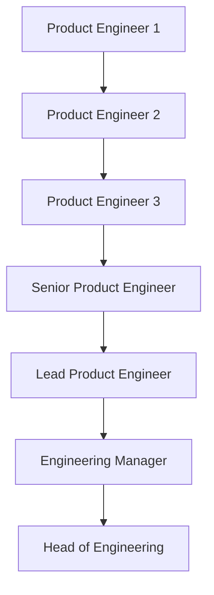

# Welcome Entry Level

Guideline for Indonesian student to land their first tech job at [Zero One Group](https://www.linkedin.com/company/zeroonegroup).

## Contents

- [Welcome Entry Level](#welcome-entry-level)
  - [Background](#background)
    - [What is Zero One Group](#what-is-zero-one-group)
    - [Investing in Our Engineers](#investing-in-our-engineers)
  - [Zero One Group Career Ladder](#zero-one-group-career-ladder)
  - [How to Get Quality Courses for Free or
    Affordable](#how-to-get-quality-courses-for-free-or-affordable)
    - [Github Student Pack](#github-student-pack)
    - [Free Courses](#free-courses)
    - [Affordable Courses](#affordable-courses)
  - [Prerequisites](#prerequisites)
  - [Getting Started](#getting-started)
  - [Backend Path](#backend-path)
  - [Web Path](#web-path)
  - [Mobile Path](#mobile-path)
  - [DevOps Path](#mobile-path)
  - [How to Apply](#how-to-apply)
  - [What Can I Do to Improve My Chances of Getting Accepted](#what-can-i-do-to-improve-my-chances-of-getting-accepted)

**[⬆ back to top](#contents)**

## Background

### What is Zero One Group

We are an ecosystem of cutting-edge technology solutions. We have multiple clients from International e.g [Bloomberg Philantropies](https://www.bloomberg.org/) to National Enterprise Company e.g [HokBen](https://www.hokben.co.id/). Currently, Our Focus technology are [Node.js](https://nodejs.org/en/), [React](https://reactjs.org/), [Flutter](https://flutter.dev), and [Terraform](https://terraform.io).

We also already giving back to the community ranging from

#### Creating or Contributing Open Source Projects

- [Geni: A Clojure dataframe library that runs on Spark](https://github.com/zero-one-group/geni)
- [fxl: ƛ fxl.js is a data-oriented JavaScript spreadsheet library](https://github.com/zero-one-group/fxl.js)
- [fastify: Fast and low overhead web framework, for Node.js](https://github.com/fastify/fastify)
- [Metabase: The simplest, fastest way to get business intelligence and analytics to everyone in your company 😋](https://github.com/metabase/metabase)
- [Prisma: Next-generation ORM for Node.js & TypeScript | PostgreSQL, MySQL, MariaDB, SQL Server, SQLite & MongoDB (Preview)](https://github.com/prisma/prisma)
- [Turborepo: The High-performance Build System for JavaScript & TypeScript Codebases](https://github.com/vercel/turborepo)
- [Node Addon Api: Module for using Node-API from C++](https://github.com/nodejs/node-addon-api)
- [Undici: An HTTP/1.1 client, written from scratch for Node.js](https://github.com/nodejs/undici)

#### Talks

- [Understanding Node.JS Performance using OpenTelemetry | Kubernetes Community Days ID 2021](https://www.youtube.com/watch?v=0Enmo1kFNSE)
- [Prinsip Dasar dalam Membuat Web Visualisasi Data Interaktif | WWW ID 2020 | Bahasa Indonesia](https://www.youtube.com/watch?v=OPX2l1P96nE)

#### Blogs

- [Ionic, React Native, and Flutter in One Nx Monorepo](medium.com/@zeroonegroup/ionic-react-native-and-flutter-in-one-nx-monorepo-ff58196a0125)
- [Customer Segmentation: Taking a Page out of the Computer Vision Book](https://medium.com/zero-one-group/customer-segmentation-taking-a-page-out-of-the-computer-vision-book-af02155ccf53)
- [Having Fun with Clojurescript on Google Cloud Function](https://medium.com/zero-one-group/having-fun-with-clojurescript-on-google-cloud-function-8434d5f94d25)

#### Contributing to Local Community Partners

- [Surabaya.js](https://surabayajs.org)
- [Surabaya.py](https://surabayapy.github.io/)
- [GDG Jogjakarta](https://gdg.community.dev/gdg-jogjakarta/)
- [GDG Surabaya](https://gdg.community.dev/gdg-surabaya/)
- [GDG Cloud Surabaya](https://gdg.community.dev/gdg-cloud-surabaya/)
- [Lamongan Dev](https://www.instagram.com/lamongandev/?hl=en)
- [Ngalam Backend](https://www.instagram.com/ngalambackend/?hl=en)
- [Data Science Indonesia](https://datascience.or.id/)

In Zero One Group, We don't have HQ for our engineers. We are first-remote company that emphasis on Async Communication. Our team spread across Indonesia, Jabodetabek, Jogjakarta, East Java, South Sulawesi and we are still expanding.

### Investing in our engineers

We are an engineering-first company, what does it mean? It means that every member of the Zero One Technology core team is an engineer or has worked as an engineer in the past - yes, even the co-founders and managers! One of our co-founders, Didit, used to always say that he would like “to build a company for engineers by engineers”.

In practice, this means that we want to make a working environment where engineers are comfortable, and productive, have the opportunity to significantly grow their technical skills and be proud of their accomplishments with the company. Curriculum, Carrer Ladder, Handbooks, Mentoring, and all the support system we created for engineers to grow. It goes without saying that engineers are first-class citizens in Zero One Group!

**[⬆ back to top](#contents)**

## Zero One Group Career Ladder

Based on Zero One Group Career Ladder, what you aiming for as an entry level are PE 1 or PE 2. PE 1 and PE 2
experiences ranging from 0 - 2 years experiences of work.

**[⬆ back to top](#contents)**

## How to Get Quality Courses for Free or Affordable

As a student, you will get benefit from multiple learning platform as long as you have your campus email `name@campus.ac.id`. Here the list which learning platform you can get for free or cheap.

### Github Student Pack

[GitHub Student Pack](https://education.github.com/pack) is the best way you can get for quality
learning platform and software tools for free!. These are multiple learning platform you can get
if you apply GitHub Student Pack (Subjects may change in the future please visit the link provided)

- [FrontendMasters - Advance your skills with in-depth JavaScript, Node.js & front-end engineering courses](https://frontendmasters.com/)
- [OneMonth - Learn HTML, CSS, JavaScript and Python in just 30 days!](https://onemonth.com/)
- [GoRails - Tutorials for web developers learning Ruby, Rails, Javascript, Turbolinks, Stimulus.js, Vue.js, and more](https://gorails.com/)
- [Thinkful - Learn Fundamentals of Web Development to launch your career as a developer](https://www.thinkful.com/)
- [Educative - Level up on trending coding skills at your own pace with interactive, text-based courses](https://educative.io)
- [DataCamp - DataCamp helps companies and individuals make better use of data. Our users build data fluency while learning from the world’s top data scientists](https://www.datacamp.com)

### Free Courses

- [FreeCodeCamp - Learn to code — for free. Build projects. Earn certifications.](https://www.freecodecamp.org/)
- [Coursera (Audit Course) - Build Skills with Online Courses from Top Institutions](https://www.coursera.org/)
- [edX - Free Online Courses by Harvard, MIT, & more](https://www.edx.org/)
- [Codecademy: Learn to Code - for Free](https://www.codecademy.com/)

### Affordable Courses

- [Udemy - Online Courses - Learn Anything, On Your Schedule](https://udemy.com)
- [Codepolitan - Website Belajar Coding Bahasa Indonesia](https://codepolitan.com/)
- [Dicoding - Bangun Karirmu Sebagai Developer Profesiona](https://www.dicoding.com/)

**[⬆ back to top](#contents)**

## Prerequisites

Before following this guideline, you must have at least understand the concept of programming in the
web. If you start from zero, you can follow this bootcamp.

- [FrontendMasters Bootcamp - Get access to everything you need to get started developing websites.
  Learn HTML, CSS and JavaScript through project-based learning](https://frontendmasters.com/bootcamp/)

or

- [FrontendMasters - Beginner Path](https://frontendmasters.com/learn/beginner/)

**[⬆ back to top](#contents)**

## Getting Started

Either you down on specific path (Backend, Frontend, Mobile, DevOps), these are courses that can
give you the fundamental. If you finish this you can apply for Product Engineer 1 position.

- [FrontendMasters - JS Fundamentals Functionals](https://frontendmasters.com/courses/js-fundamentals-functional-v2/)
- [FrontendMasters - CSS Grids and Flexbox](https://frontendmasters.com/courses/css-grid-flexbox-v2/)
- [FrontendMasters - Full Stack for Front End](https://frontendmasters.com/courses/fullstack-v2/)
- [FrontendMasters - Complete Intro for Linux and Command Line](https://frontendmasters.com/courses/linux-command-line/)
- [FrontendMasters - Introduction to Node JS](https://frontendmasters.com/courses/node-js-v2/)
- [FrontendMasters - Complete Intro to Containers](https://frontendmasters.com/courses/complete-intro-containers/)
- [FrontendMasters - Api Design in Node JS](https://frontendmasters.com/courses/api-design-nodejs-v3/)
- [FrontendMasters - Learn Git in Depth](https://frontendmasters.com/courses/git-in-depth/)
- [FrontendMasters - Intro all Databases](https://frontendmasters.com/courses/databases/)
- [FrontendMasters - Introduction to DevTools](https://frontendmasters.com/courses/dev-tools/)
- [Udemy - Complete NodeJS Developer](https://www.udemy.com/course/complete-nodejs-developer-zero-to-mastery/)
- [FrontendMasters - TypeScript Fundamentals](https://frontendmasters.com/courses/typescript-v3/)
- [FrontendMasters - Complete Intro React](https://frontendmasters.com/courses/complete-react-v6/)
- [FrontendMasters - Intermediate React](https://frontendmasters.com/courses/intermediate-react-v2/)

**[⬆ back to top](#contents)**

## Backend Path

- [FrontendMasters - Functional JavaScript First Steps](https://frontendmasters.com/courses/functional-first-steps/)
- [Udemy - SQL and PostgreSQL](https://www.udemy.com/course/sql-and-postgresql/)
- [FrontendMasters - Intermediate TypeScript](https://frontendmasters.com/courses/intermediate-typescript/)
- [Udemy - Docker for Node.js Projects From a Docker Captain](https://www.udemy.com/course/docker-mastery-for-nodejs/)
- [Udemy - GitLab CI: Pipelines, CI/CD and DevOps for Beginners](https://www.udemy.com/course/gitlab-ci-pipelines-ci-cd-and-devops-for-beginners/)
- [Udemy - Introduction to Database Engineering](https://www.udemy.com/course/database-engines-crash-course/)
- [Udemy - gRPC Node.js MasterClass: Build Modern API & Microservices](https://www.udemy.com/course/grpc-nodejs/)
- [FrontendMasters - Complete Intro to Real-Time](https://frontendmasters.com/courses/realtime/)
- [Udemy - Pragmatic System Design](https://www.udemy.com/course/pragmatic-system-design/)
- [UML and Object-Oriented Design Foundations](https://www.udemy.com/course/uml-and-object-oriented-design-foundations/)
- [Master Fullstack - React, Fastify Node.js, Postgresql & TDD](https://www.udemy.com/course/fullstack-project-react-fastify-nodejs-postgresql-tdd/)

**[⬆ back to top](#contents)**

## Frontend Path

- [FrontendMasters - Functional JavaScript First Steps](https://frontendmasters.com/courses/functional-first-steps/)
- [FrontendMasters - Build a Fullstack App from Scratch (feat Next.js)](https://frontendmasters.com/courses/fullstack-app-next/)
- [FrontendMasters - React and TypeScript](https://frontendmasters.com/courses/react-typescript/)
- [FrontendMasters - Web Performance](https://frontendmasters.com/courses/web-perf/)
- [FrontendMasters - Intermediate TypeScript](https://frontendmasters.com/courses/intermediate-typescript/)
- [Udemy - GitLab CI: Pipelines, CI/CD and DevOps for Beginners](https://www.udemy.com/course/gitlab-ci-pipelines-ci-cd-and-devops-for-beginners/)
- [Udemy - Testing React with Jest and Testing Library](https://www.udemy.com/course/react-testing-library/)
- [Udemy - Cypress: Web Automation Testing from Zero to Hero](https://www.udemy.com/course/cypress-web-automation-testing-from-zero-to-hero/)
- [FrontendMasters - AWS For Front-End Engineers, v2](https://frontendmasters.com/courses/aws-v2/)
- [Udemy - Master Fullstack - React, Fastify Node.js, Postgresql & TDD](https://www.udemy.com/course/fullstack-project-react-fastify-nodejs-postgresql-tdd/)

**[⬆ back to top](#contents)**

## Mobile Path

- [Udemy - Flutter & Dart - The Complete Guide 2022 Edition](https://www.udemy.com/course/learn-flutter-dart-to-build-ios-android-apps/)
- [Youtube - Testing Fundamentals of Flutter Course](https://www.youtube.com/playlist?list=PLprI2satkVdFwpxo_bjFkCxXz5RluG8FY)
- [Udemy - The Complete Dart Language Guide for Beginners and Beyond](https://www.udemy.com/course/complete-dart-guide/)
- [Udemy - Flutter & Firebase: Build a Complete App for iOS & Android](https://www.udemy.com/course/flutter-firebase-build-a-complete-app-for-ios-android/)
- [Udemy - Flutter REST API Crash Course: Build a Coronavirus App](https://www.udemy.com/course/flutter-rest-api-crash-course-build-a-coronavirus-app/)

**[⬆ back to top](#contents)**

## DevOps Path

- [Udemy - GitLab CI: Pipelines, CI/CD and DevOps for Beginners](https://www.udemy.com/course/gitlab-ci-pipelines-ci-cd-and-devops-for-beginners/)
- [Udemy - Ultimate AWS Certified Cloud Practitioner - 2022](https://www.udemy.com/course/aws-certified-cloud-practitioner-new/)
- [Udemy - GCP for Beginners - Become a Google Cloud Digital Leader](https://www.udemy.com/course/google-cloud-digital-leader-certification/)
- [Udemy - Introduction to NGINX](https://www.udemy.com/course/nginx-crash-course/)
- [Udemy - Amazon ECS & Fargate Master Class - Docker on AWS](https://www.udemy.com/course/aws-ecs-fargate/)
- [Udemy - Learn DevOps: Infrastructure Automation With Terraform](https://www.udemy.com/course/learn-devops-infrastructure-automation-with-terraform)
- [Udemy - Terraform Beginner to Advanced - Using Google Cloud Platform](https://www.udemy.com/course/terraform-beginner-to-advanced-using-google-cloud-platform/)
- [Udemy - Ansible for the Absolute Beginner - Hands-On - DevOps](https://www.udemy.com/course/learn-ansible-advanced/)

**[⬆ back to top](#contents)**

## How to Apply

Please send your CV and/or Portofolio to info@zero-one-group.com with cc to doni@zero-one-group.com.
All the process will conducted asynchronously except for the Interview.

**[⬆ back to top](#contents)**

## What Can I Do to Improve My Chances of Getting Accepted

- Experience with finishing MOOC.
- Open Source Contribution.
- Side Project or Portofolio.
- Participating in Tech Community Activities.
- Have deeper Understanding about TypeScript Typing.
- Experienced with Testing and Create Your own CI/CD pipeline.
- Impress us with your NeoVim setup! hahah Just Joking 😆

**[⬆ back to top](#contents)**
